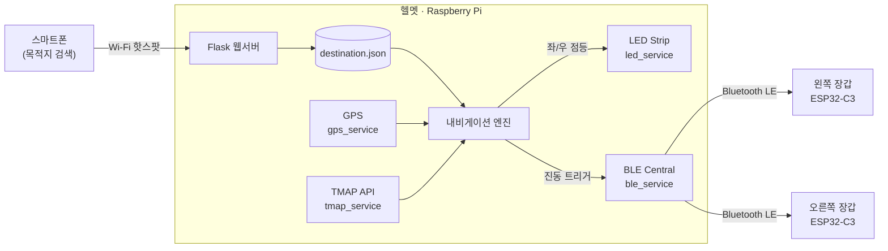

# PM 운전자를 위한 내비게이션 경로 안내 기반 스마트 헬멧

> TMAP 내비게이션 경로를 따라 회전 지점에서 헬멧의 방향지시등을 자동으로 켜고,
> 같은 방향의 장갑에 진동 피드백을 전달하는 **PM(Personal Mobility) 운전자 보조 시스템**

## 프로젝트 소개

PM 운전자의 **회전 의사를 자동으로 표시하는 스마트 헬멧**과, 이와 연동된 **진동 피드백 장갑**을 결합한 운전자 보조 시스템입니다.

스마트폰으로 목적지를 설정하면, 헬멧의 라즈베리파이가 GPS와 TMAP 경로를 비교하여 회전 지점 접근 여부를 판단합니다. 회전 지점에 가까워지면 헬멧의 좌/우 LED Strip이 자동으로 점등됨과 동시에 해당 방향의 장갑에 진동이 발생하여, 운전자가 전방에서 시선을 떼지 않고도 직관적으로 주행 방향을 인지할 수 있도록 합니다.

## 배경 및 개발 동기

PM 운전자는 주행 중 회전 의사를 주변에 전달해야 하지만, 기존 방식은 **시인성**과 **안정성** 측면에서 한계가 있습니다.

- **시인성 부족** — PM은 방향지시등과 같은 등화장치가 없는 경우가 많아, 특히 야간·교차로·A필러 사각지대 환경에서 매우 치명적입니다.
- **회전 의사 전달 수단의 문제** — 수신호는 법적 의무이지만 이를 이해하는 운전자는 일부에 불과하고, 수신호를 위해 주행 중 한 손을 떼면 그 자체로 사고 위험이 커집니다. 시중에 출시된 스마트헬멧은 리모컨식 방향지시등을 채택하고 있어, 이 역시 조작을 위해 손을 떼야 하는 문제와 점등 여부를 직접 확인할 수 없다는 문제를 가지고 있습니다.

이를 해결하기 위해 **① 손을 떼지 않는 자동 점등**, **② 운전자 눈높이에 보이는 방향지시등 위치**, **③ 점등 여부를 알려주는 촉각 피드백**을 목표로 본 프로젝트를 진행했습니다.

## 주요 기능

### 1. 경로 기반 방향지시등 자동 점등
- TMAP 보행자 경로 안내를 기준으로, GPS 실시간 위치와 다음 회전 지점까지의 거리를 계산합니다.
- 회전 지점 **약 50m 전방** 진입 시 회전 방향(좌/우)에 맞춰 헬멧 LED Strip이 자동 점등됩니다.
- 회전 지점 **10m 이내** 통과 시 자동 소등하고 다음 안내 지점으로 전환합니다. (프로토타입 GPS 모듈의 오차 고려)
- 손을 뗄 필요 없이, 스마트폰 목적지 입력만으로 전 과정이 자동으로 동작합니다.

### 2. 방향지시등과 연동된 진동 피드백
- 점등된 방향과 동일한 쪽 장갑으로 **BLE(Bluetooth Low Energy)** 를 통해 진동 트리거를 전송합니다.
- 장갑(ESP32-C3) 펌웨어가 진동 모터를 **0.6초 진동 / 0.2초 휴식 패턴**으로 구동합니다.
- 운전자는 화면을 보지 않고도 방향지시등 점등 여부와 회전 지점 임박을 촉각으로 인지할 수 있습니다.

### 3. 스마트폰 목적지 검색 웹 UI
- 라즈베리파이 핫스팟에 접속한 스마트폰에서 목적지를 키워드로 검색합니다 (TMAP POI).
- 검색 결과(최대 5개) 중 하나를 선택하면 통합 모드(`helmet_app.py`)에서 내비게이션이 자동으로 시작됩니다.

## 동작 방식

```
1. 목적지 입력  →  2. 경로 정보 수신  →  3. 회전지점 접근  →  4. LED 점등  →  5. 장갑 진동  →  6. 회전 완료
```

1. **목적지 입력** — 스마트폰으로 Flask 웹 서버에 접속해 목적지를 검색·선택
2. **경로 정보 수신** — TMAP 보행자 경로 및 회전 안내 지점 로드
3. **회전지점 접근** — GPS로 다음 회전 지점까지의 거리를 실시간 계산
4. **LED 점등** — 50m 전방에서 회전 방향에 맞춰 헬멧 LED 자동 점등
5. **장갑 진동** — 동일 방향 장갑에 진동 피드백 전달
6. **회전 완료** — 10m 이내 통과 시 자동 소등 후 다음 구간으로 전환



> 내비게이션 루프는 **2초 주기**로 현재 위치를 갱신하며, GPS 오차를 고려해 **점등(50m)** 과 **통과·소등(10m)** 기준 거리를 분리해 판정합니다.
> Flask 웹 서버 / GPS 수신 / TMAP 호출 / LED 제어 / BLE 통신이 동시에 동작해야 하므로, **asyncio 기반 비동기 처리**와 백그라운드 스레드로 구성되어 있습니다.

## 시스템 구조

| 구성 | 역할 | 핵심 기술 |
| --- | --- | --- |
| **헬멧 (Raspberry Pi)** | 두뇌 역할. 웹서버 · GPS 수신 · TMAP 경로 판단 · LED 제어 · BLE Central | Python, Flask, bleak, rpi-ws281x |
| **장갑 (ESP32-C3 ×2)** | BLE Peripheral. 진동 트리거를 받아 진동 모터 구동 | Arduino (C++), BLE |

- 라즈베리파이가 BLE **Central**, 좌/우 장갑이 각각 BLE **Peripheral** 역할을 합니다.
- 두 장갑은 각각의 **MAC 주소**(`BLE_LEFT_MAC`, `BLE_RIGHT_MAC`)로 식별되며, 공통 Characteristic UUID를 통해 진동 시작/정지 신호를 주고받습니다.

## 강점

**손을 떼지 않는 자동 점등 → 주행 안정성 향상**
- 점등·소등에 손을 뗄 필요가 없어 균형 상실 위험을 제거합니다.
- 별도의 리모컨이나 물리 조작 장치가 없어 분실·이탈 위험이 없습니다 (스마트폰 입력만으로 동작).

**차량 운전자 눈높이에서의 시각 신호**
- 헬멧 좌/우 LED가 회전 방향을 시각적으로 표시해, 뒤따르는 차량 운전자가 PM의 다음 움직임을 예측하는 데 도움을 줍니다.
- 차체 하단이 아닌 운전자 눈높이에 위치해 근거리에서도 인식이 용이합니다.

**촉각 채널을 활용한 정보 전달**
- 손목은 머리·발목·팔 대비 진동 인지가 가장 명확한 부위라는 점에 착안해 장갑(손목) 진동을 채택했습니다.
- 0.6초 진동 / 0.2초 휴식 패턴은 관련 논문을 기반으로 설계했습니다.
- 음성·화면 등 기존 시청각 대신 촉각이라는 새로운 채널로 "점등 여부"라는 단순한 정보만 전달해 인지 부하를 줄였습니다.

## 하드웨어 구성

- **헬멧** : 라즈베리파이, GPS 모듈, LED Strip(WS281x), 보조배터리, 브레드보드
- **장갑** : ESP32-C3 Super Mini, 진동 모터, 소형 브레드보드, 건전지 소켓

## 기술 스택

- **헬멧 (Raspberry Pi)** : Python · asyncio · Flask · requests(TMAP API) · bleak(BLE Central) · rpi-ws281x(LED) · python-dotenv
- **장갑 (ESP32-C3)** : Arduino (C++) · BLE
- **외부 API** : TMAP (경로 안내 · POI 검색)

## 디렉터리 구조

```
Smart_Helmet/
├── helmet_app.py        # 통합 진입점: Flask 웹서버 + 백그라운드 내비 스레드 (권장 실행)
├── app.py               # (분리 실행용) 목적지 검색·확정 웹서버 → destination.json 저장
├── main.py              # (분리 실행용) destination.json 기반 실시간 내비게이션 루프
├── config.py            # .env 로드 (BLE MAC 주소, Characteristic UUID)
├── gps_web_test.py      # GPS 단독 수신 테스트 유틸리티
├── requirements.txt     # Python 의존성
│
├── services/                # 핵심 기능 모듈 패키지
│   ├── navigation.py        #   실시간 내비게이션 코루틴 (helmet_app가 사용)
│   ├── gps_service.py       #   GPS(UART) 수신 루프 · 현재 위치 · 거리 계산
│   ├── gps_web_service.py   #   GPS 단독 수신 테스트용 Flask 웹 서버 구현
│   ├── tmap_service.py      #   TMAP 보행자 경로 탐색 · 안내지점/회전정보 관리
│   ├── poi_service.py       #   TMAP POI 키워드 검색
│   ├── led_service.py       #   헬멧 LED Strip(WS281x) 좌/우 점멸 제어
│   └── ble_service.py       #   BLE Central → 장갑으로 진동 트리거 전송
│
├── templates/
│   └── index.html       # 목적지 검색 웹 UI (스마트폰 접속)
│
└── ble_recep/           # ESP32-C3 장갑 수신기 펌웨어 (Arduino / C++ 스케치)
```

> `destination.json`(현재 목적지)과 `.env`(BLE MAC 주소·API 키)는 실행 중 생성되거나 비밀 정보를 담는 파일로, 레포지토리에는 커밋되지 않습니다.

## 설치 및 실행

### 1. 라즈베리파이 시리얼(UART) 활성화 — GPS 연결 전 필수

라즈베리파이는 기본적으로 시리얼 포트(`/dev/serial0`)를 '리눅스 터미널 로그인용'으로 사용하고 있습니다. GPS를 연결하기 전에 아래 설정을 반드시 한 번 풀어주어야 합니다.

```bash
sudo raspi-config
```

1. `3 Interface Options` 선택
2. `I5 Serial Port` 선택
3. *"Would you like a login shell to be accessible over serial?"* → **No** (중요)
4. *"Would you like the serial port hardware to be enabled?"* → **Yes**
5. 재부팅

```bash
sudo reboot
```

이 설정을 마치고 선을 연결하면, 코드 수정 없이 GPS 데이터가 라즈베리파이로 들어오기 시작합니다.

### 2. 의존성 설치

```bash
git clone https://github.com/autojjangs/Smart_Helmet.git
cd Smart_Helmet
pip install -r requirements.txt
pip install flask        # 웹 서버용 (필요 시)
```

### 3. 환경 변수 설정 (`.env`)

프로젝트 루트에 `.env` 파일을 만들고 장갑 수신기의 MAC 주소와 TMAP API 키를 설정합니다.

```env
BLE_LEFT_MAC=XX:XX:XX:XX:XX:XX
BLE_RIGHT_MAC=YY:YY:YY:YY:YY:YY
# TMAP 앱 키 (services/tmap_service.py · poi_service.py 참고)
TMAP_APP_KEY=your_tmap_app_key
```

### 4. 장갑 펌웨어 업로드

`ble_recep/` 의 Arduino 스케치를 Arduino IDE로 열어 각 **ESP32-C3** 보드에 업로드합니다. 업로드 후 확인되는 보드의 MAC 주소를 위 `.env`의 좌/우 값에 입력합니다.

### 5. 실행

**통합 모드 (권장)**

```bash
sudo python helmet_app.py
```

- 라즈베리파이 핫스팟에 스마트폰을 연결한 뒤 브라우저에서 `http://<라즈베리파이_IP>:5000` 접속
- 목적지를 검색·선택하면 내비게이션이 자동으로 시작됩니다.

**분리 모드**

```bash
python app.py     # 1) 웹에서 목적지 확정 → destination.json 저장
python main.py    # 2) 저장된 목적지로 실시간 내비게이션 실행
```

**테스트 / 시뮬레이션 모드** (환경 변수 `HELMET_TEST_MODE`)

| 값 | 동작 |
| --- | --- |
| `0` | 실제 모드 (GPS + 실제 LED + 실제 BLE) — 기본값 |
| `1` | 경로 파싱 전용 (GPS 없이 고정 출발지로 경로만 출력 후 종료) |
| `2` | 이동 시뮬레이션 (가상 위치를 경로 따라 전진시켜 LED/진동 트리거 검증, 하드웨어 미사용) |

```bash
sudo HELMET_TEST_MODE=2 python helmet_app.py
```

## 팀

**피지컬컴퓨팅 팀 프로젝트 4조**

장기준 · 윤무진 · 석민준 · 김정원

